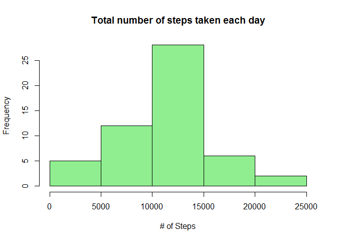
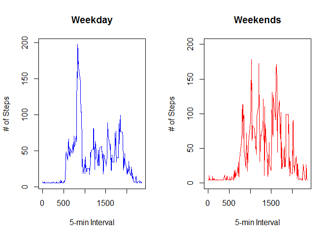

# Reproducible Research: Peer Assessment 1
Stenio Fernandes  
2016-02-13  


## Loading and preprocessing the data

```r
# Reading dataset
cat("Reading dataset as a data frame...\n")
```

```
## Reading dataset as a data frame...
```

```r
activity <- as.data.frame(read.csv("activity.csv"), stringsAsFactors=FALSE)
OriginalActivity <- activity
```

## What is mean total number of steps taken per day?

```r
# 1. Make a histogram of the total number of steps taken each day
# 2. Calculate and report the mean and median total number of steps taken per day

AggStepsDay <- aggregate(steps~date, activity, sum)
hist(AggStepsDay$steps, main=paste("Total number of steps taken each day"),
     col = "lightgreen",
     xlab= "# of Steps")
```



```r
cat("Mean total number of steps per day:", mean(AggStepsDay$steps), "\n")
```

```
## Mean total number of steps per day: 10766.19
```

```r
cat("Median total number of steps per day:", median(AggStepsDay$steps), "\n")
```

```
## Median total number of steps per day: 10765
```

## What is the average daily activity pattern?


```r
# 1. Make a time series plot (i.e. type = "l") of the 5-minute interval (x-axis) 
#    and the average number of steps taken, averaged across all days (y-axis)

AggStepsInterval <- aggregate(steps~interval, data=activity, mean, na.rm=TRUE)
with(AggStepsInterval, plot(interval, steps, type = "l", 
                            col="blue", ylab = "# of Steps", xlab = "5-min Interval"))
```


```r
# 2. Which 5-minute interval, on average across all the days in the dataset, 
#    contains the maximum number of steps?

MaxSteps <- AggStepsInterval[which.max(AggStepsInterval$steps),]
cat("Maximum (average) number of steps is", MaxSteps$steps, "at the interval", MaxSteps$interval, "min\n")
```

```
## Maximum (average) number of steps is 206.1698 at the interval 835 min
```

## Imputing missing values


```r
cat("Number of missing values in the dataset:", length(which(is.na(activity))), "\n")
```

```
## Number of missing values in the dataset: 2304
```

```r
cat("Creating new dataset and imputing...\n")
```

```
## Creating new dataset and imputing...
```

```r
ImpActivity <- activity
StepsNA <- with(ImpActivity, is.na(steps))
MeanSteps <- mean(ImpActivity$steps, na.rm = TRUE)
ImpActivity$steps[StepsNA] <- MeanSteps

AggStepsDayImp <- aggregate(steps~date, ImpActivity, sum)

cat("Mean total number of steps per day:", mean(AggStepsDayImp$steps), "\n")
```

```
## Mean total number of steps per day: 10766.19
```

```r
cat("Median total number of steps per day:", median(AggStepsDayImp$steps), "\n")
```

```
## Median total number of steps per day: 10766.19
```

```r
par(mfcol=c(1,2))
hist(AggStepsDayImp$steps, main=paste("# of steps - Imputed"),
     col = "lightblue",
     xlab= "# of Steps")
hist(AggStepsDay$steps, main=paste("# of steps"),
     col = "lightgreen",
     xlab= "# of Steps")
```


### Q. Do these values differ from the estimates from the first part of the assignment? 
#### A. Not much, since the imputation was based on the overal mean value

### Q. What is the impact of imputing missing data on the estimates of the total daily number of steps?
#### A. Increased a bit


## Are there differences in activity patterns between weekdays and weekends?

### Yes, there are. Right plot show less activities in the weekends


```r
DataWithWeekdays <- transform(ImpActivity, day=weekdays(as.Date(activity$date)))

DataWithWeekdays$day <- ifelse(DataWithWeekdays$day == "sábado" | DataWithWeekdays$day == "domingo", "Weekend", "Weekday")

par(mfrow=c(1,2))
AggStepsInterval <- aggregate(steps~interval, data=DataWithWeekdays, mean, subset=day=="Weekday", na.rm=TRUE)
with(AggStepsInterval, plot(interval, steps, type = "l", 
                            col="blue", ylab = "# of Steps", xlab = "5-min Interval", 
                            main = "Weekday"), ylim = c(0,200))
AggStepsInterval <- aggregate(steps~interval, data=DataWithWeekdays, mean, subset=day=="Weekend", na.rm=TRUE)
with(AggStepsInterval, plot(interval, steps, type = "l", 
                            col="red", ylab = "# of Steps", xlab = "5-min Interval",
                            main = "Weekends", ylim = c(0,200)))
```



